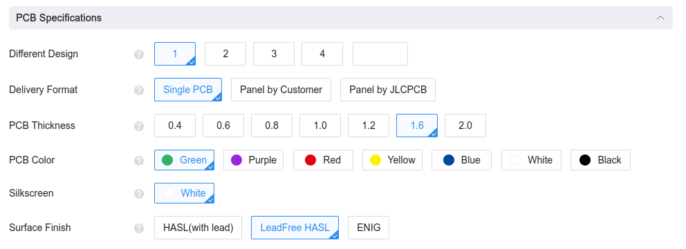

# CP SOM ONE

The CP SOM ONE is a Open Source System-On-Module that features an FPGA Artix7 from AMD. 

## Images

 

 

 

 

**More information in [controlpaths.com](https://www.controlpaths.com/2023/10/28/designing-a-fpga-som/)**

## Get yours

The CP SOM ONE is open source and all the files are shared. If you want to build your own, you can to go to the [JLCPCB](https://jlcpcb.com/?from=controlpaths) website, click on Order Now, and upload a zip file with all the fabrication files.

 

Then, you have to configure some aspects of the board. For this SOM, I just changed the Surface Finish to LeadFree HASL. Also, you can customize the color of your board.

 

When the PCB service options are ready, then you have to select the PCB Assembly process. here we have to set whether the components are on one or both sides of the board, and the quantity we need. 

 

Then, when we confirm the board, the web application will ask us for two files, the position file for the components, and the bill of materials. Both files are generated in KiCad and are available in the GitHub repository.

Finally, you have to complete the order and two weeks later, the board will be in your house.
